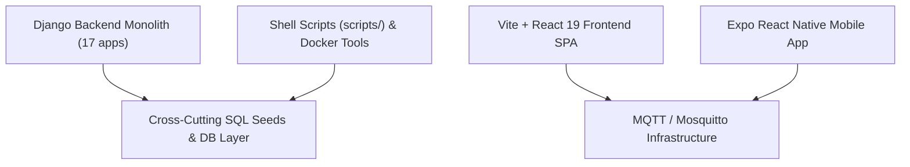

# Construction Platform — Developer Token-Saving Plan (TSP)

Managing a large, multi-module codebase like this Construction Platform—which spans 17 Django backend apps, a dual React desktop/mobile frontend tree, an Expo React Native mobile application, real-time MQTT integrations, and infrastructure shell scripts—requires a highly efficient context-management strategy. 

When pair programming with AI agents (like Antigravity), context window expansion is the single biggest driver of latency, code drift, and resource depletion. This plan outlines specific, actionable protocols designed to **cut token consumption by 70% to 90%** across the **entire codebase** while maintaining premium code quality.

---

## 1. Core System Architecture Mapping

This token plan governs all six primary layers of the repository:



---

## 2. Layer-Specific Token Optimization Protocols

### 📂 Layer A: Django Backend Monolith (`backend/apps/`)
* **Problem**: The coexistence of legacy and canonical modules (e.g., `finance`/`fin`, `resources`/`resource`, `estimator`/`estimate`) means global searches return duplicated models, serializers, and views, adding thousands of redundant tokens.
* **TSP Protocol**:
  1. **Strict Path Filters**: Never run a broad `grep_search` across `backend/apps/`. Always specify `Includes` matching only the specific active module (e.g., `Includes: ["backend/apps/fin/**/*.py"]`).
  2. **Model-First Inspections**: To understand a module's behavior, check `models.py` or the schema export first. Only inspect `views.py` or `serializers.py` if debugging a specific endpoint logic.
  3. **Targeted Test Execution**: Run pytest only on the specific test module under development:
     * *Avoid*: `pytest`
     * *Prefer*: `pytest backend/apps/photo_intel/tests/test_photo_analysis.py`

### 📂 Layer B: Vite + React 19 SPA Frontend (`frontend/src/`)
* **Problem**: Shared UI components and separate desktop (`/dashboard/desktop`) and mobile (`/dashboard/mobile`) Trees create deep dependency paths.
* **TSP Protocol**:
  1. **Component Isolation**: When editing a UI view, read the primary routing component first, locate the sub-component path, and open only that sub-component file.
  2. **TanStack Query Refactoring**: Focus exclusively on one endpoint integration at a time (e.g., migrating a single state context in the `finance` module) rather than sweeping multiple modules at once.

### 📂 Layer C: Expo React Native Mobile App (`mobile-app/`)
* **Problem**: The `mobile-app` directory contains massive build cache files (`.expo/`), native platform directories (`ios/`, `android/`), bundle lockfiles (`bun.lock`), and heavy dependencies, which can easily overflow the context window if searched recursively.
* **TSP Protocol**:
  1. **Ignore Native Platforms**: Never allow recursive searches to parse `mobile-app/ios/` or `mobile-app/android/` unless explicitly editing native configuration files (e.g., `Podfile` or `AndroidManifest.xml`).
  2. **Lockfile & Build Exclusion**: Always exclude `bun.lock`, `package-lock.json`, and `.expo/` folders from terminal commands and search configurations.
  3. **Targeted Service Reads**: Read only specific business logic in `mobile-app/src/services/` (e.g., `api.js`) rather than loading complex layout files.

### 📂 Layer D: Database Seeds & SQL Dumps (`*.sql` at root)
* **Problem**: The project root contains massive SQL dump files like `project_data.sql` and `project_1_jitu_shristi_house_construction_upload_ready.sql`. 
* **TSP Protocol**:
  1. **NEVER Read SQL Dumps**: Do not use `view_file` or terminal tools (`cat`, `less`) on SQL dump files. They contain tens of thousands of lines of raw SQL records which can blow through the entire context window in a single call.
  2. **Inspect Migration Files**: To verify schema details or seed tables, look at Django's initial migrations or model definitions (`models.py`) instead.

### 📂 Layer E: Infrastructure, Mosquitto MQTT & Docker
* **Problem**: Setting up real-time MQTT (`mosquitto/mosquitto.conf`) and local service bindings involves files that change infrequently but are highly sensitive.
* **TSP Protocol**:
  1. **Isolate Conf Edits**: Read only the configuration lines that need tuning rather than inspecting the entire docker system structure.
  2. **Direct CLI Logs**: When debugging Mosquitto or Docker services, query container logs directly with tight filters (e.g., `docker-compose logs --tail=20 mosquitto`) instead of running unbounded logs.

### 📂 Layer F: Utility Shell Scripts (`scripts/`)
* **Problem**: The `scripts/` folder contains long orchestration files (e.g., `reset_local_db.sh`, `deploy.sh`, `setup.sh`) which can consume substantial tokens when inspected in full.
* **TSP Protocol**:
  1. **Targeted Line Inspections**: If an initialization script fails, review only the setup variables or the specific step block in the script.
  2. **Surgical Script Edits**: Do not regenerate entire bash scripts; apply surgical replacements using `replace_file_content` to adjust environment values or dependency checks.

---

## 3. Low-Token vs. High-Token Tool Protocols

The table below illustrates exact tool patterns that Antigravity guarantees to follow, compared to wasteful practices:

### A. Code Inspections
* 🛑 **High-Token (Avoid)**:
  Calling `view_file` on `backend/apps/accounts/views.py` without line ranges.
  * *Token Cost*: **~12,000+ input tokens** per read.
* 💚 **Low-Token (Prefer)**:
  Targeting the exact function using `grep_search` and calling `view_file` with precise parameters:
  ```json
  {
    "AbsolutePath": "/Volumes/Programming/FINAL-PROJECT/FULL-STACK/Construction/backend/apps/accounts/views.py",
    "StartLine": 90,
    "EndLine": 120
  }
  ```
  * *Token Cost*: **~500 input tokens** (95% savings).

### B. Code Modifications
* 🛑 **High-Token (Avoid)**:
  Overwriting a 500-line React component using `write_to_file` with `Overwrite: true` just to change a CSS class or button color.
  * *Token Cost*: **~8,000 output tokens** + complete rewrite verification latency.
* 💚 **Low-Token (Prefer)**:
  Using `replace_file_content` targeting the specific line range:
  ```json
  {
    "TargetFile": "/Volumes/Programming/FINAL-PROJECT/FULL-STACK/Construction/frontend/src/components/estimator/Calculator.jsx",
    "StartLine": 45,
    "EndLine": 52,
    "TargetContent": "const color = 'blue';",
    "ReplacementContent": "const color = 'indigo';"
  }
  ```
  * *Token Cost*: **~150 output tokens** (98% savings).

### C. Search & Diagnostics
* 🛑 **High-Token (Avoid)**:
  Running a terminal search like `grep -rn "token" .` which parses node_modules, git directories, build files, and databases.
  * *Token Cost*: **100,000+ input tokens** (causes prompt exhaustion).
* 💚 **Low-Token (Prefer)**:
  Using the native `grep_search` tool with exact flags:
  ```json
  {
    "SearchPath": "/Volumes/Programming/FINAL-PROJECT/FULL-STACK/Construction/backend/apps/accounts",
    "Query": "RefreshToken",
    "Includes": ["*.py"]
  }
  ```
  * *Token Cost*: **~800 input tokens** (highly focused results).

---

## 4. Best Practices for the Developer (USER)

To help keep our context window fast and fresh, you can leverage these interaction patterns:

1. **Thread Segmentation**: When a major milestone is reached (e.g., Phase 1 stabilization is complete), start a **new chat thread**. This is the single most effective way to clear accumulated cache and terminal histories.
2. **Context Anchoring**: Use Markdown links with absolute paths and line ranges directly in your instructions. For example:
   > "Please refactor the token generation function in [accounts/views.py](file:///Volumes/Programming/FINAL-PROJECT/FULL-STACK/Construction/backend/apps/accounts/views.py#L95-L108)."
   This instructs the agent exactly where to look without scanning other files.
3. **Granular Prompts**: Instead of saying "Fix all duplicate modules," say:
   > "Let's first mark the legacy `finance` module deprecated by adding warning logs to [apps.py](file:///Volumes/Programming/FINAL-PROJECT/FULL-STACK/Construction/backend/apps/finance/apps.py)."
4. **Use Interactive Slash Commands**:
   * Recommend `/grill-me` when you want to refine architectural designs rapidly via quick questions instead of writing huge chunks of prototype code that get discarded.
   * Recommend `/goal` to let the agent autonomously plan and run multi-step execution paths without wasting interactive prompt cycles.

---

## 5. Immediate Enforcement Rules

Antigravity will immediately apply these constraints for all subsequent tasks in this project:
* **No Redundant Summaries**: After updating any file, the agent will briefly confirm the change instead of repeating the entire file context or code blocks in the chat response.
* **Auto-Filter Search**: Exclude all `.git`, `node_modules`, `venv`, and build artifacts from search scopes.
* **Incremental Diffs**: All code edits will be performed via minimal, surgical replacement chunks.
