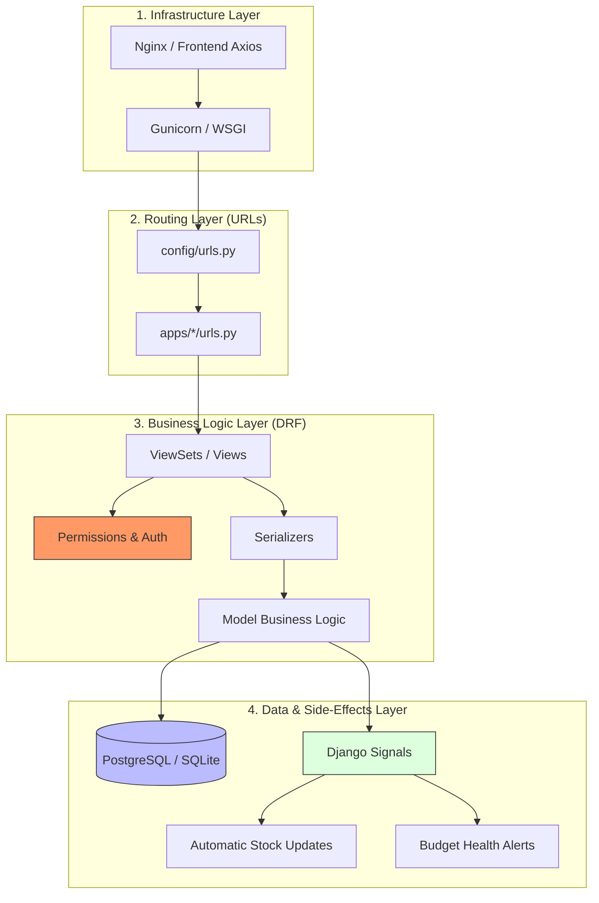

# Backend Architecture

This document provides a high-level overview of the Django REST Framework architecture powering the House Construction Management System.

## Architecture Flow

The following diagram illustrates the lifecycle of a request as it moves through the backend layers:



## Functional Module Flow (Non-Technical)

For non-technical understanding, the backend is organized into "Engines" that power specific features on the website:

### 🔐 Authentication Engine (`apps.accounts`)
*   **What it does**: Handles logins, registers new users (Contractors vs. Owners), and manages role-based access.
*   **Integration**: Every other engine checks with this one to ensure the user is allowed to see or change data.

### 💰 Financial Ledger Engine (`apps.finance`)
*   **What it does**: The central accounting system. It tracks where money comes from (Loans/Savings) and where it goes (Expenses/Contractor Payments).
*   **Integration**: Automatically talks to the **Project Engine** to alert you if you are spending more than your planned budget.

### 📦 Inventory Engine (`apps.resources`)
*   **What it does**: Keeps track of every "Bora" of cement and "Tipper" of sand. It logs inward deliveries and outward site usage.
*   **Integration**: When a material is used in a construction task, this engine automatically subtracts it from your stock levels.

### 🏗️ Project Engine (`apps.core`)
*   **What it does**: Stores the "Master Plan"—the house name, total budget, floors, rooms, and construction phases.
*   **Integration**: Acts as the anchor for everything else. Tasks and Expenses must "belong" to a Phase or a Room defined here.

### 📜 Permit & Legal Engine (`apps.permits`)
*   **What it does**: Manages the "Naksha Pass" journey, tracking approval steps and legal documents required by the municipality.

---

## Directory Tree (`/backend`)

```text
backend/
├── config/              # Central Project Configuration
│   ├── settings.py      # Database, Auth, and App settings
│   └── urls.py          # Root API Routing (The Gateway)
├── apps/                # Modular Application Features
│   ├── accounts/        # User, Authentication, and Permissions
│   ├── core/            # Project, Phases, Floors, and Rooms
│   ├── finance/         # Budgeting, Expenses, and Payments
│   ├── tasks/           # Site Tasks, Media Uploads, and Updates
│   ├── resources/       # Inventory, Suppliers, and Contractors
│   ├── permits/         # Municipal Permit Status Tracking
│   └── estimator/       # Material & Budget Calculation Logic
├── raw_data_population/ # Scripts to seed the DB with Nepali context data
├── utils/               # Shared utilities (Audit logging, Audit utils)
├── manage.py            # Django CLI entry point
└── requirements.txt     # Backend dependencies (Django, DRF, etc.)
```
