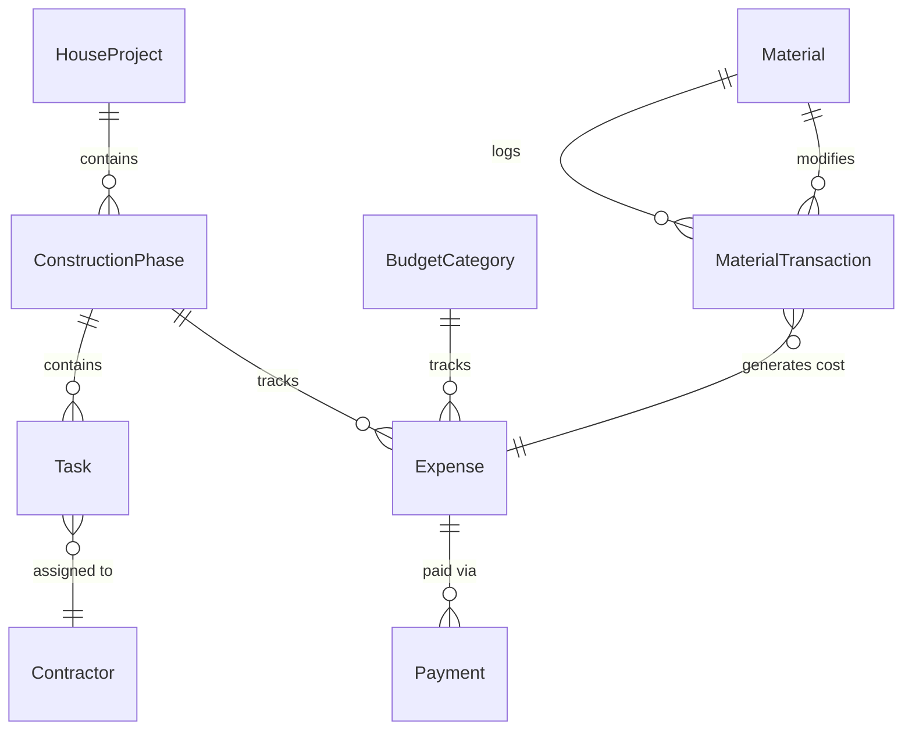

# Backend Models & Logic

This document details the database schema and cross-model relationships within the Django backend.

## Architecture Entity-Relationship (ER) Diagram

## Detailed Database Schema

---

### 🏗️ Core Engine (`apps.core`)

> [!NOTE]
> Core handles the master timeline, physical layout, and project status.

#### `HouseProject` (Singleton)
| Field | Type | Description |
| :--- | :--- | :--- |
| `name` | String | Project Master Name |
| `total_budget` | Decimal | The globally allocated total budget |
| `start_date` | Date | Project start date |
| `area_sqft` | Integer | Total area built |

> [!IMPORTANT]
> **Business Logic**: Exposes a `budget_health` property that aggregates allocations from the Finance Engine and flags if the project is "OVER_ALLOCATED" or "OVER_SPENT".

#### `ConstructionPhase`
| Field | Type | Description |
| :--- | :--- | :--- |
| `name` | String | Phase name (e.g., DPC, Slab Dhalaan) |
| `status` | Enum | Pending, In Progress, Completed |
| `estimated_budget` | Decimal | Budget planned for this specific phase |
| `permit_status` | Enum | Pending, Approved, Rejected |

---

### 💰 Finance Engine (`apps.finance`)

> [!NOTE]
> Detailed ledger system tracking every rupee in and out of the project.

#### `BudgetCategory` & `Expense`
| Model | Key Fields | Description |
| :--- | :--- | :--- |
| **BudgetCategory** | `name`, `allocation`, `total_spent` | Macro allocations (e.g., "Labor", "Cements"). Automatically sums linked Expenses. |
| **Expense** | `amount`, `expense_type`, `is_paid` | The primary ledger for individual cost items. Links to almost everything (Phases, Materials, Tasks). |

> [!WARNING]
> **Auto-Calculations**: Saving an `Expense` triggers a check. If `current_spent + amount > allocation`, the system fires a signal that updates the project's health status.

#### `Payment` & `FundingSource`
| Model | Key Fields | Description |
| :--- | :--- | :--- |
| **Payment** | `amount`, `method`, `proof_photo` | Tracks actual cash given out. Can be partial payments toward an `Expense`. |
| **FundingSource** | `source_type`, `amount`, `current_balance` | Tracks external cash injections (Bank Loans, Personal Savings). |

> [!TIP]
> **Virtual "Direct Settlement" Relationship**: While `Expense` and `Payment` are separate records in the database, the frontend identifies "Twin Entries" (where a bill and full payment happen at the same time) and represents them as a single **Direct Settlement** in the UI to simplify history and audit trails.

---

### 📦 Resources Engine (`apps.resources`)

> [!NOTE]
> Manages the physical inventory and the human labor database.

#### `Material` & `MaterialTransaction`
| Model | Key Fields | Description |
| :--- | :--- | :--- |
| **Material** | `unit` (Bora/Tip), `reorder_level` | The item catalog. Calculates `current_stock` dynamically. |
| **MaterialTransaction** | `type` (IN/OUT/WASTAGE), `quantity` | Every inward/outward site movement. |

> [!TIP]
> **Stock Auto-Sync**: When a `MaterialTransaction` is saved as `OUT` (used), it instantly updates the `current_stock` level. If `IN` (purchased) is saved, it automatically generates a Finance `Expense`.

#### `Contractor` & `Supplier`
| Model | Key Fields | Description |
| :--- | :--- | :--- |
| **Contractor** | `role` (Mistri/Engineer), `daily_wage`, `skills` | Human labor. Can be directly linked to a login `User`. |
| **Supplier** | `pan_number`, `account_number`, `balance_due` | Hardware stores and aggregate vendors. |

---

### 🔨 Tasks Engine (`apps.tasks`)

#### `Task` & Auditing
| Model | Key Fields | Description |
| :--- | :--- | :--- |
| **Task** | `status`, `priority`, `blocked_by` | Day-to-day granular work units assigned to contractors. |
| **TaskUpdate** | `progress_percentage`, `note` | Status updates for auditing tasks. |
| **TaskMedia** | `file`, `media_type` | Image/video proof-of-work uploads. |

> [!IMPORTANT]
> **Task Dependencies**: A Task cannot be marked `COMPLETED` if its `blocked_by` foreign key task is still pending.

---

### 🔐 Accounts & Identity (`apps.accounts`)

> [!CAUTION]
> Manages strict RBAC (Role-Based Access Control) and security audits.

| Model | Key Fields | Description |
| :--- | :--- | :--- |
| **Role** | `code`, `can_manage_finances`... | Detailed boolean-based access control. |
| **User** | `email`, `profile_image`, `typography` | Extended identity model allowing customizable UI preferences. |
| **ActivityLog**| `action`, `model_name`, `changes` (JSON) | Immutable ledger. Tracks who clicked what, the IP address, and payload diffs. |
