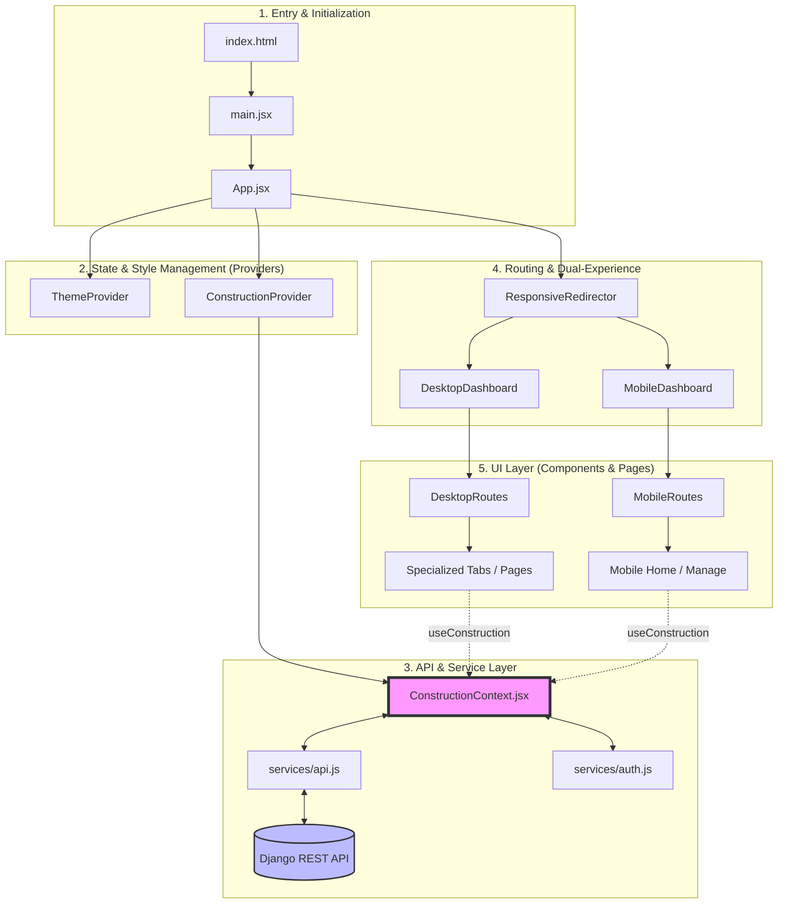

# Frontend Architecture

This document provides a high-level overview of the React (Vite) frontend architecture.

## Application Architecture Flow

The following diagram illustrates the relationship and data flow between the core files in the `/src` directory:



## User Experience Flow (Non-Technical)

For non-technical stakeholders, the application follows a straightforward "Menu > Submenu" hierarchy designed around the construction lifecycle:

### 1. Primary Site Navigation (Sidebar)
*   **🏠 Dashboard (ड्यासबोर्ड)**: The "Command Center" showing overall progress, days elapsed, and real-time budget health.
*   **🧮 Estimator (इस्टिमेटर)**: Tools to calculate how many bricks, how much cement, or how much total budget you need.
*   **📜 Permits (नक्सा पास)**: Tracker for legal milestones (Municipality approval, blueprint verification, etc.).
*   **🛠️ Manage (व्यवस्थापन)**: The core database for organizing the building process.
*   **📸 Gallery (फोटो ग्यालरी)**: A visual archive of site photos, bills, and legal certificates.
*   **📚 User Guide (मद्दत निर्देशिका)**: Instructions, FAQs, and help for new users.

### 2. Deep-Dive: Management Flow (`🛠️ Manage > ...`)
The Manage section is further subdivided into three logical pillars:

#### 🏗️ Project Structure
*   `Manage > Schedule (कार्यतालिका)`: Creating and tracking major milestones (e.g., Foundation, Ground Floor Slab).
*   `Manage > Structure (संरचना)`: Defining the building's physical layout (Floors, Rooms).

#### 💰 Financial Control
*   `Manage > Finance > Accounts`: Full Chart of Accounts management with real-time General Ledger balances.
*   `Manage > Finance > Ledger`: A double-entry transaction journal for auditing all debits and credits across the project.
*   `Manage > Finance > Bills`: Accounts Payable (AP) management for tracking and settling vendor liabilities.
*   `Manage > Finance > Funding`: Capital sourcing and debt tracking (Loans, Own Capital).
*   `Manage > Overview`: Real-time liquidity analysis (Available Cash vs. Total Payables) powered by the `finance_summary` aggregation.

#### 📦 Resource & Inventory
*   `Manage > Suppliers (सप्लायर्स)`: Catalog of hardware stores and material vendors.
*   `Manage > Contractors (ठेकेदार)`: Database of labor crews (Mistris, Helpers, Engineers).
*   `Manage > Materials (सामग्री)`: Master list of units (Bora, Tipper, KG).
*   `Manage > Stock (मौज्दात)`: Live inventory levels showing what's currently on-site and what needs re-ordering.

---

## Premium Component Logic

### 1. Smart History Merger (Direct Settlement)
To reduce financial clutter, the frontend implements a **Smart History Merger**.
- **Logic**: If an `Expense` (Bill) and a `Payment` share the same timestamp, amount, and recipient, the UI collapses them into a single **"DIRECT SETTLEMENT"** entry.
- **Benefit**: Users see one clear transaction instead of two redundant records, mirroring real-world "Pay as you go" behavior.

### 2. Universal Payment Modal
A context-aware orchestration component used in both Desktop and Mobile experiences:
- **Entity Detection**: Automatically switches logic between Contractors (Labor) and Suppliers (Materials).
- **Embedded Intelligence**: Displays bank details for suppliers and triggers automated PDF receipts via the backend.

### 3. Interactive GL & Treasury Suite
New specialized modals for deep financial management:
- **Bank Transfer Modal**: Orchestrates asset relocation between bank accounts with automated double-entry posting.
- **Journal Entry Modal**: Features real-time balance validation (Debits must equal Credits) before allowing a manual post to the ledger.
- **Liability (Bill) Modal**: Allows recording of vendor invoices without immediate cash outflow, correctly establishing a liability in the General Ledger.

---

## Directory Tree (`/src`)

```text
src/
├── App.jsx
├── assets
│   └── react.svg
├── components
│   ├── Login.jsx
│   ├── ProtectedRoute.jsx
│   ├── common/
│   ├── desktop/
│   ├── finance/         # UniversalPaymentModal and shared financial components
│   │   └── expenses/    # Sub-modules: UnifiedPaymentList, PaymentModals, SummaryCards
│   └── mobile/          # Mobile-optimized views (Tabs & Lists)
├── constants/
├── context/
│   ├── ConstructionContext.jsx
│   └── ThemeContext.jsx
├── index.css
├── main.jsx
├── pages/
│   ├── accounts/
│   ├── desktop/
│   ├── estimator/
│   ├── mobile/
│   └── permits/
├── routes/
│   ├── desktop/
│   └── mobile/
├── services/
│   ├── api.js
│   └── auth.js
├── styles/
└── utils/
```
